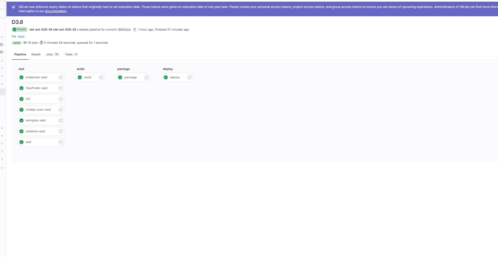
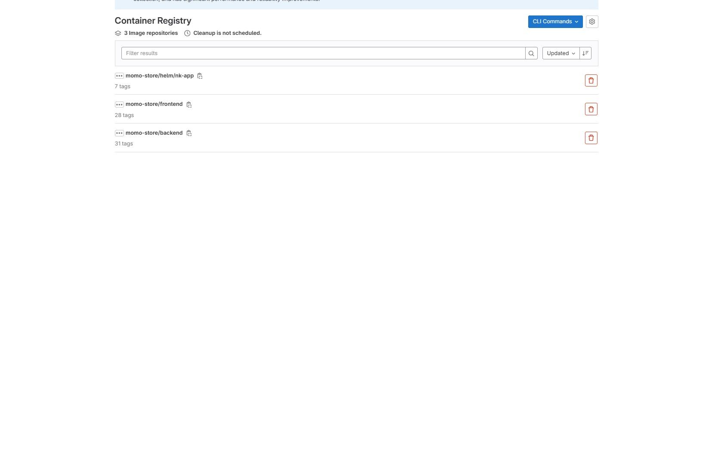
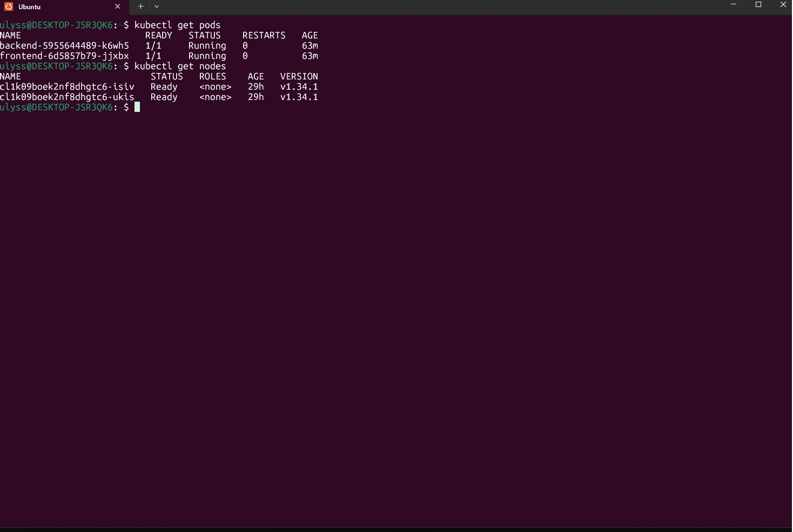
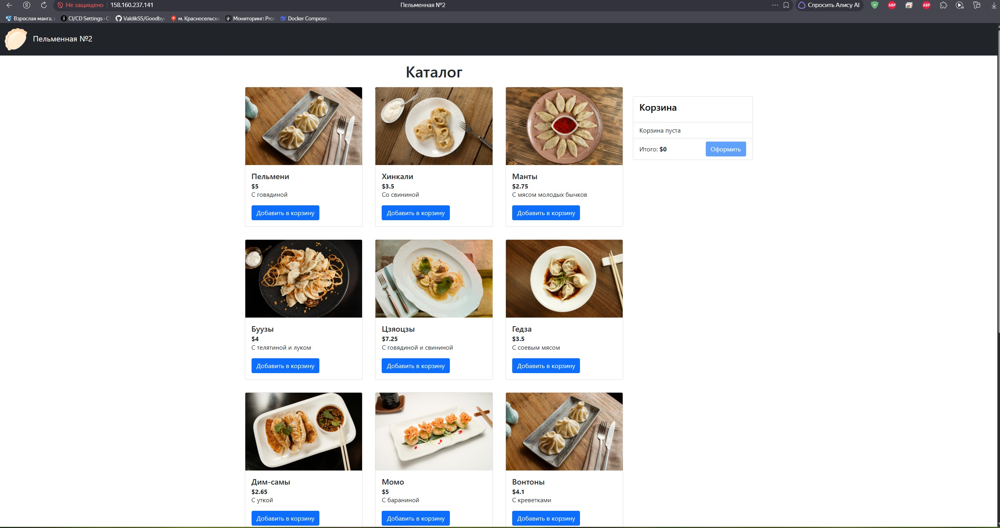
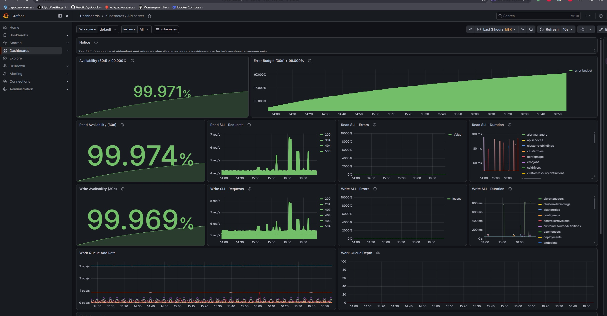
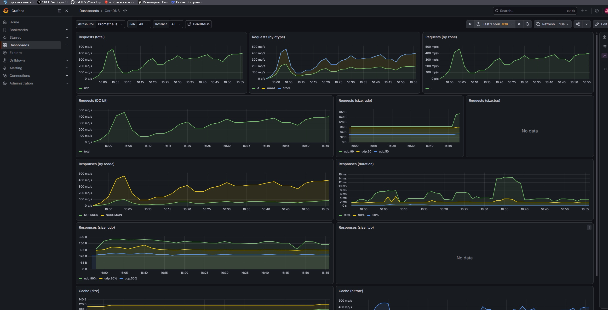
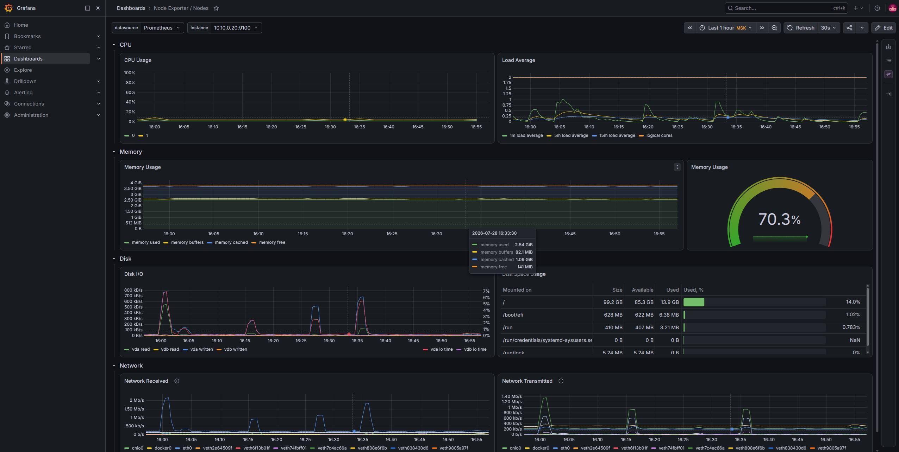
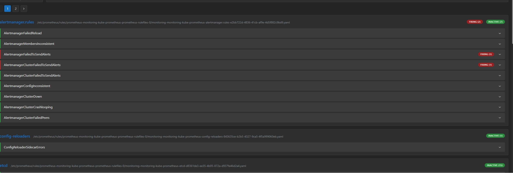
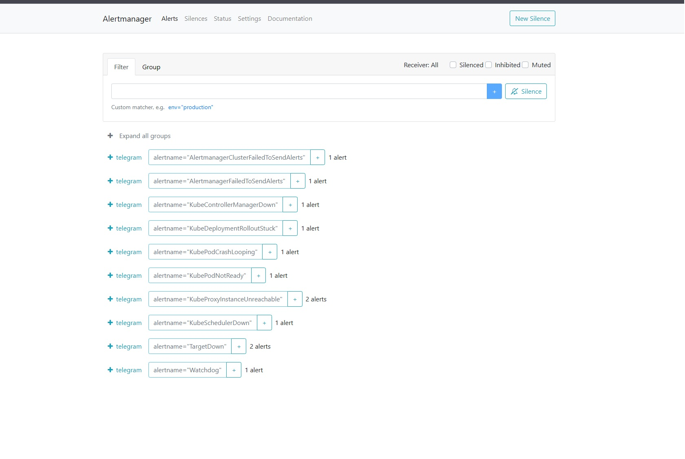

Дипломный проект практикум в Yandex.Cloud

Александров Александр Владимирович.

# Momo Store — инфраструктура и CI/CD

## Назначение
Документация описывает устройство репозитория, порядок развёртывания
облачной инфраструктуры и приложения, правила внесения изменений,
релизный цикл и версионирование артефактов.

## Устройство репозитория
Репозиторий содержит исходный код приложения, инфраструктурные
конфигурации, Helm-чарты и пайплайны CI/CD.

- `backend/` — исходный код API на Go.
- `frontend/` — исходный код SPA на Vue.js.
- `infra/` — Terraform-конфигурация облачной инфраструктуры.
- `helm/nk-app/` — Helm-чарт приложения.
- `Dockerfile.backend`, `Dockerfile.frontend` — сборочные образы.
- `nginx.conf` — конфигурация Nginx для фронтенда.
- `.gitlab-ci.yml` — пайплайн CI/CD.
- `alertmanager-config.yaml` — настройка оповещений Telegram.
- `prometheus-rules.yaml` — правила алертов.
- `README.md` — настоящий документ.

## Локальный запуск (Docker Compose)

Приложение можно запустить целиком на локальной машине без Kubernetes,
Terraform и облачных сервисов — только через Docker Compose.

### Предварительные требования

- Docker Engine 20.10+ и Docker Compose v2.
- Свободные порты `80` (фронтенд) и `8081` (backend).

### Запуск

```bash
docker compose up -d --build
docker compose ps
```

После старта откройте в браузере [http://localhost](http://localhost).

Если порт `80` занят, замените в `docker-compose.yml` маппинг
`"80:80"` на, например, `"8080:80"`.

### Проверка работоспособности

```bash
# Каталог товаров (14 позиций)
curl -s http://localhost/api/products

# Категории
curl -s http://localhost/api/categories

# Здоровье backend
curl -s http://localhost:8081/health

# Метрики Prometheus
curl -s http://localhost:8081/metrics
```

### Остановка

```bash
docker compose down
docker compose down -v   # дополнительно удалить тома (если есть)
```

### Устройство сервисов

| Сервис    | Порт (контейнер) | Порт (хост) | Описание                          |
|-----------|------------------|-------------|-----------------------------------|
| backend   | 8081             | 8081        | REST API на Go (chi), метрики     |
| frontend  | 80               | 80          | Nginx + SPA (Vue.js), прокси /api |

### Известные ограничения

- Backend использует in-memory (fake) хранилище: товары захардкожены в
  [`dependencies/store.go`](backend/cmd/api/dependencies/store.go), заказы
  не сохраняются между перезапусками.
- Эндпоинты `/auth/login`, `/auth/logout`, `/auth/change-password` и `/csrf`
  в Go-бэкенде не реализованы — страница входа работать не будет. Каталог,
  категории и корзина (клиентская, в localStorage) работают.
- Изображения товаров подгружаются с внешнего CDN (`res.cloudinary.com`).

## Развёртывание инфраструктуры
1. Установите Yandex Cloud CLI и настройте профиль, указав
   авторизованный ключ сервисного аккаунта `terraform-sa`.
2. Создайте S3-бакет `nk-tfstate-ulysses43` для хранения состояния
   Terraform.
3. Перейдите в каталог `infra/`, создайте файл `backend.conf` с ключами
   доступа S3.
4. Выполните:
terraform init -backend-config=backend.conf
terraform plan
terraform apply

Управляемый Kubernetes-кластер создаётся вручную командой
`yc managed-kubernetes cluster create`, затем импортируется в
Terraform.
5. Убедитесь, что кластер доступен:
yc managed-kubernetes cluster get-credentials nk-k8s-cluster --external
kubectl get nodes

[Managed Kubernetes кластер](screen/b1.jpg)
[Terraform state в S3](screen/k1.jpg)
[Сервисный аккаунт](screen/services.jpg)


## Развёртывание приложения
### Автоматический деплой (CI/CD)
Пайплайн запускается при пуше в ветку `main` или теге.
Этапы:
- SAST, юнит-тесты Go, линтинг Vue (ESLint).
- Сборка Docker-образов бэкенда и фронтенда (Kaniko), публикация в
GitLab Container Registry.
- Упаковка Helm-чарта и публикация в GitLab Container Registry как
OCI-артефакта.
- Деплой в Kubernetes через `helm upgrade --install`.
- Принудительный перезапуск подов для гарантированного обновления
DNS-резолвинга headless-сервиса backend.

### Ручной деплой
helm upgrade --install nk-app ./helm/nk-app
--set backend.image.tag=<SHA>
--set frontend.image.tag=<SHA>
--namespace default

### Доступ к приложению
Сервис `frontend` имеет тип LoadBalancer. Внешний IP можно получить
командой `kubectl get svc frontend`. Приложение открывается по этому IP
в браузере.

Сайт доступен по адресу - http://158.160.237.141







## Правила внесения изменений в инфраструктуру
- Все изменения в каталоге `infra/` вносятся через Merge Request.
- Перед применением обязательно выполняется `terraform plan`, вывод
  прикладывается к MR.
- После одобрения выполняется `terraform apply`.
- Состояние Terraform хранится в S3-бакете `nk-tfstate-ulysses43`, что
  исключает конфликты при параллельной работе.

## Релизный цикл и правила версионирования
- Ветка `main` используется для production-релизов. Пуш в `main`
  запускает полный пайплайн.
- При создании тега формата `vX.Y.Z` Docker-образы получают
  соответствующий тег и выполняется деплой.
- Docker-образы тегируются коротким SHA коммита
  (`$CI_COMMIT_SHORT_SHA`). При наличии тега используется имя тега.
- Helm-чарт получает версию `0.1.$CI_PIPELINE_ID`, что гарантирует
  уникальность и прослеживаемость.
- Артефакты (образы и чарты) публикуются в GitLab Container Registry и
  GitLab Package Registry соответственно (аналог Nexus).

## Мониторинг, логирование и алертинг
- Prometheus, Grafana и Loki развёрнуты в пространстве имён
  `monitoring`.
- Для доступа к Grafana используйте port-forward:
kubectl port-forward -n monitoring svc/monitoring-grafana 8080:80


Учётные данные: `admin` / `admin123` (заданы при установке).
- В Grafana настроены дашборды:
- Kubernetes (состояние кластера, ресурсы);
- Kubernetes Logs (логи приложения через Loki).
- Alertmanager отправляет оповещения о критических сбоях в Telegram.
Правила алертов находятся в `prometheus-rules.yaml`.
Пример сообщения:
Авария: BackendDown
Описание: Backend pod has been down for more than 1 minute.
Статус: firing
Из за проблем с тг, оставил скрины с Alertmanager и Prometheus







## Статические файлы
Изображения и другие небинарные файлы хранятся в S3-бакете
`nk-static-bucket-ulysses43`. Загруженный логотип доступен публично:
`https://nk-static-bucket-ulysses43.website.yandexcloud.net/logo.png`

## Секреты
Все чувствительные данные (токены, пароли, ключи) хранятся в
переменных CI/CD GitLab. В репозитории открытых секретов нет.

## Использованные технологии
- Yandex Managed Kubernetes (v1.34)
- Terraform (инфраструктура как код)
- GitLab CI/CD (Kaniko, Helm)
- Prometheus, Grafana, Loki (мониторинг и логирование)
- Alertmanager (алертинг в Telegram)
- Vue.js, Go, Nginx
- Yandex Object Storage (S3)